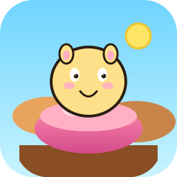
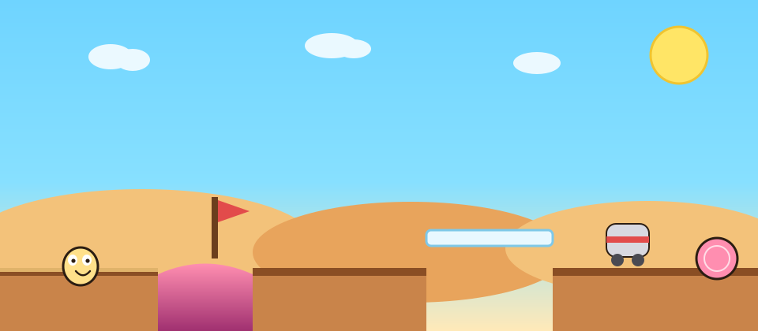

<p align="center">
  
</p>

<h1 align="center">布丁峡谷</h1>

<p align="center">
  给 7 岁小朋友的横版过关小游戏。<br>
  路牌会说谎，陷阱反直觉，试错才是玩法。
</p>

<p align="center">
  
  
  
</p>

<p align="center">
  
</p>

现在有两关：第一关 **请勿相信路牌**，第二关 **没人提示**。

## 怎么玩

用浏览器直接打开 [`index.html`](index.html)，不用安装、不用构建。

| 操作 | 按键 |
| --- | --- |
| 走路 | ← → 或 `A` `D` |
| 跳跃 | 空格 / ↑ / `W` |
| 再玩一次 | 通关后点按钮 |
| 下一关 | 打过第一关后出现 |
| 回第一关 | 第二关通关后可点 |

左上角是试错次数。掉下去或碰到真危险会回到本关开头，再走一遍。

## 第一关 · 请勿相信路牌

看上去危险的往往没事，看上去像终点的往往是画的。

| 你看到的 | 其实是 |
| --- | --- |
| 「危险！粘浆坑」 | 布丁弹簧，踩上去会弹 |
| 「终点 →」和高台旗子 | 旗子是画上去的 |
| 「安全桥」 | 白桥很滑 |
| 「吸尘器是朋友」 | 真危险，碰到会重来 |
| 「大门在这边」 | 门也是画的 |
| 「毛线球不要碰」 | 粉毛线球才是家 |

## 第二关 · 没人提示

打过第一关，点通关画面上的「下一关」。

这一关 **没有路牌**。峡谷里静悄悄的，陷阱会突然冒出来：有的地板会跑掉，有的东西会从天上或草丛里蹦出来。至少十个小意外。第一关教你的“常识”，这里可能反过来——看起来熟的东西，不一定还是老朋友。

具体有什么？到了才知道。

## 项目结构

```
pudding-canyon/
├── index.html         # 页面和 HUD
├── style.css          # 窗口、提示、通关层
├── game.js            # 两关逻辑、物理、绘制
├── level.json         # 关卡宽度等基础数据
├── LICENSE            # MIT
├── assets/icon.svg    # 项目图标 / favicon
└── docs/cover.svg     # README 封面
```

纯静态：`index.html` + `style.css` + `game.js`，没有依赖。

## 许可

[MIT](LICENSE)
